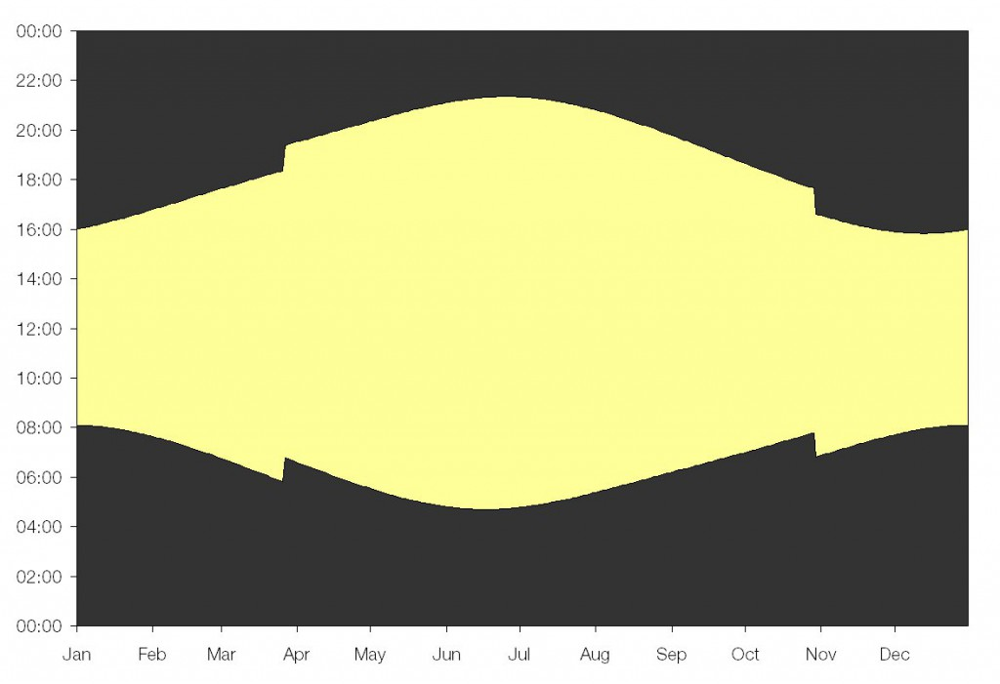

# Individual project - Energy saving automatic outside light

## Explanation of my Work
My solution makes use of Timers to keep track of time and various metrics, such as the day of week and year, to correctly account for daylight savings time, leap years, etc.

The Timer0 module is set to overflow once an hour (once a second in test_mode), and Timer1 represents the hour of the day as it is set to count the overflow of Timer0.
Timer1's value, the hour of day, is displayed on the LEDArray. 

The LDR triggers an interruption and toggles the state of the LED RH3 once the ambient light is lower/higher than the threshold. 
Between 1AM and 5AM the LED is turned off and the comparator is disabled so that the LED can't be toggled by the LDR.

At the end of every day the code resets Timer1 to zero, increments the day of week and day of year variables. 
If the end of day corresponds to the end of the year, the year variable is incremented and checked to see if it is a leap year, and the toggles for daylight savings time are switched to zero.

**Daylight savings Time:**
Clocks are wound forward at the last sunday of March and wound back at the last sunday of October, on 2AM. In non leap years these occur between the 84-90th, and 298-304th days of the year (+1 day in leap years). If the dst_fwd and/or dst_fwd variables are 0, and the appropriate day of year has been reached, the code checks to see if it is the 7th day of the week and 2AM, and wounds back the clock and toggles the dst variables to 1. 

**Time Drift and correct Timer intervals**
See the attached images for detailed calculations for selecting Timer0 clock source, pre-scaler, and initialization values.
In real mode, Timer0 uses LFINTOSC, a 31KHz oscillator, with Prescaler: 2048, and starts each cycle at 11044 so that it overflows almost every hour.
The imprecision leads to a time drift of -108.5 seconds per year, which is counteracted by making Timer0 run for 2 seconds longer once every week by starting it at 11012.
The only other inaccuracy comes from the 4 instruction cycles of 62.5 ns each that are needed to correctly initialise and restart Timer0 once it overflows, but this leads to a 
negligible time drift only.

**Why this approach**
If I had to rely on readings of time gathered from when the LDR triggered an interrupt, the lights would have to be switched on at dawn, off at dusk, and then stay on throughout the night except for 1-5AM. But external factors, such as a clouds or fog during the day, or carlights during the night, could trigger the LDR and so mess up the time calculations. Also the solar noon can have a range of 60 minutes throughout the year so it is not very accurate to base time readings off that.
My code has a lot of continuous checking of time but this doesn't negatively influence the working of the system, except for maybe negligible increase in power consumption.
All the checks are running continiously in the main function and not in interrupts, because otherwise the interrupts would be too frequent and long.

**Initialization**
You need to input the correct day of year, day of week, year, and leap year and daylight savings toggles for everything to function properly (hour is optional). The program starts off at midnight 30th October, 2021, so that in the following day you can observe daylights savings. The kit is set to be turned on in ambient light conditions that fall below the DAC threshold.

## Timer Calculations 
[RealModeCalc](https://user-images.githubusercontent.com/78698413/140614996-f6b541c2-116c-46bd-858d-c5358b41d4c7.jpg)

[RealModeCalc2](https://user-images.githubusercontent.com/78698413/140614999-6157572d-41d8-4dcb-807b-cc9c8f24aa2d.jpg)

[testmodeCalc](https://user-images.githubusercontent.com/78698413/140615000-53303abf-f2a2-41cd-a73c-fac0508a3a6b.jpg)

## Demo Video
Please see file ECMMiniProjDemo.mp4 or
https://www.youtube.com/watch?v=ccwbNL4MLFM

## Learning outcomes

The principal learning objectives for this project are:

- Implement a working microprocessor based system to achieve a more complex real world task
- Develop your ability to independently plan, organise and structure your code 
- Improve your grasp of the C language and writing your own functions

## Brief!
Outside lights that respond to ambient light levels are commonplace (i.e. street lights, porch lights, garden lights etc). These types of lights switch on at dusk and then turn off at dawn. However, energy and money can be saved if these lights are switched off during the small hours of the morning (for example, between 1am and 5am), when there are very few people around. Many councils in the UK have implemented/trialled this idea for street lights (https://www.bbc.co.uk/news/uk-england-derbyshire-16811386). Your task is to use the knowledge of microcontrollers and hardware that you have gained in labs 1-3 from this module to develop a fully automated solution.

## Specification
Design and program a device that meets the following requirements:

1. Monitors light level with the LDR and turns on an LED in low light conditions (i.e. night-time) and off in bright conditions (i.e. daytime)
1. Displays the current hour of day on the LED array in binary
1. Turns the light off between approx. 1am and 5am
1. Adjusts for daylight savings time
1. Maintain synchronicity with the sun indefinitely
1. Be fully automatic (requires zero maintenance after installation)

Please use this GitHub repo to manage your software development and submit your individual project code.

## Supplementary information and help
At first the task may seem quite straightforward but there are several points that often prove more tricky. The first is how to test code during development? You could test in real world conditions but you would be limited to one test cycle per day and this would severely slow down your development and debugging progress. To get around this you could implement a "testing mode" and pretend that a day lasts 24 seconds. This could be done using a #define directive to switch between "normal" and "testing" modes for your code.

Adjusting for daylight savings time is not too tricky. The clocks always change (in the UK) on the last Sunday in March (they go forward an hour) and the last Sunday in October (they go back an hour). One method of achieving this is to initialise what day it is when device is first switched on (using manual input) and then keep track of the days that pass and what the day of the week it is. Another method might be to automatically figure out what time of year it is (see below). Also don't forget about leap years! 

No clock is perfect, they can all run slightly fast/slow and can by influenced be external factors such as temperature. Ultimately this will result in drift over time and eventually the time will drift so far out of sync with real time that it is meaningless. For the purposes of our device the main requirement is that it remains in sync with the sun. You could use light from the sun to keep your clock in sync. Although the length of daylight varies considerably during the year, the midpoint between dusk and dawn only varies by a few minutes. This is termed solar midnight approx. 12am or solar noon approx. 12pm. One method of staying in sync with the sun is to use the LDR and record/calculate when these times occur and adjust your clock accordingly. The length of daylight also tells us information about what time of year it is and can be used to help us know when to adjust for daylight savings time.

http://wordpress.mrreid.org/2010/10/31/why-change-the-clocks/

